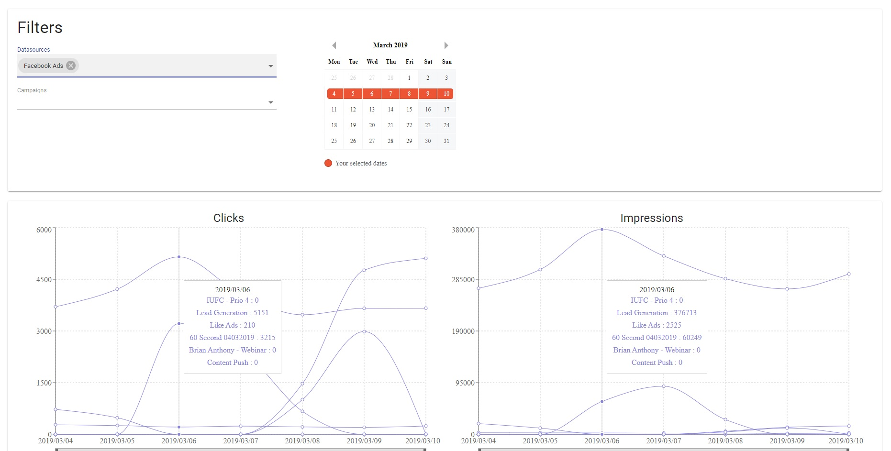

# Charts example with Django and React



**NOTE:** Not intended for production (no nginx configuration, debug enabled).

## How to run it

1. Clone the repository to the current directory:

    ```
    git clone https://github.com/pasta96/django-react-chart-example.git
    ```

2. Start Django backend

    ```
    cd backend
    pipenv install
    python manage.py migrate
    python manage.py collectstatic
    python manage.py load_daystats_from_csv example_daystats_data.csv 
    python manage.py runserver
    ```

3. Start React frontend

    ```
    cd frontend
    npm install 
    npm start
    ```

4. Open it in the browser http://localhost:3000
